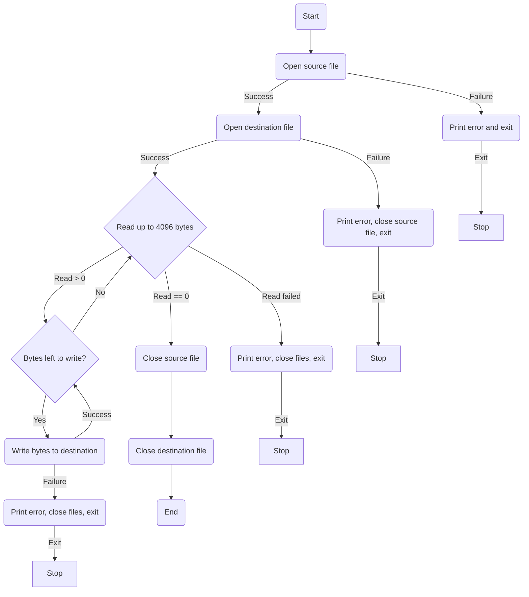

# Copy Command

## How it works?
This command copies a file by **reading it in small chunks** (4 KB at a time) and writing each chunk to a new file. If you imagine a **16 KB file**, it is split into **four 4 KB blocks**, which are read and written one by one until the entire file is copied.

## 📊 Workflow Diagram


## 🚀 How to Run
### 1️⃣ Compile the program

**For C:**
```sh
gcc copy.c -o copy
```
**For Rust:**
```sh
cd copy
cargo build --release
mv target/release/copy .
```

### 2️⃣ Run the command
```sh
./copy source.txt destination.txt
```

Replace `source.txt` with the file you want to copy and `destination.txt` with the output file.

### 3️⃣ Option: Move the binary to a system path
Once the binary is built, move it to a directory that is included in your system's `$PATH`, such as `/usr/local/bin`:
```sh
sudo mv copy /usr/local/bin/
sudo chmod +x /usr/local/bin/copy
```
📌 **Explanation:**

- `mv copy /usr/local/bin/` → Moves the binary to a globally accessible location.
- `chmod +x /usr/local/bin/copy` → Ensures it's executable.
Now you can run the command from any directory.
```sh
copy file1.txt file2.txt
```

## 🛠 Error Handling
- If the source file **doesn’t exist**, the program exits with an error.
- If there’s an issue **writing to the destination file**, it also exits with an error.
- All files are **closed properly** after copying to avoid resource leaks.

## 📌 Notes
- Uses a **4 KB buffer size** for efficiency.
- Works on **Unix-based systems** (Linux/macOS).

